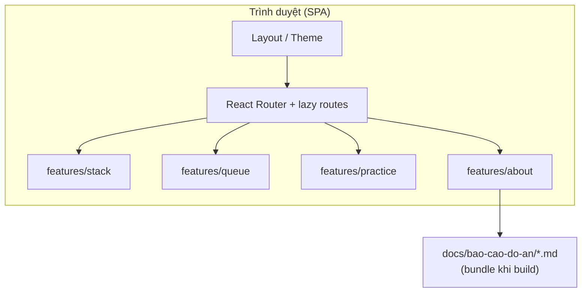

# Chương 3. Phân tích và thiết kế

## 3.1. Phân tích yêu cầu

### 3.1.1. Yêu cầu chức năng

| STT | Yêu cầu | Mô tả |
|-----|---------|--------|
| F1 | Trang chủ | Giới thiệu ứng dụng, liên kết nhanh tới Stack, Queue, luyện tập |
| F2 | Mô phỏng Stack | Push/Pop (hoặc tương đương) có phản hồi trực quan |
| F3 | Infix → Postfix | Nhập biểu thức, hiển thị bước hoặc kết quả chuyển đổi |
| F4 | Mô phỏng Queue | Enqueue/Dequeue có phản hồi trực quan |
| F5 | Mô phỏng BFS | Hiển thị đồ thị nhỏ và trình tự duyệt theo BFS |
| F6 | Luyện tập | Trắc nghiệm Stack/Queue, lọc chủ đề, nộp bài và xem điểm |
| F7 | About / Tài liệu | Hiển thị nội dung các file Markdown trong `docs/bao-cao-do-an/`, có mục lục và tham số `?doc=` để mở đúng phần |

### 3.1.2. Yêu cầu phi chức năng

- **Khả năng sử dụng:** giao diện rõ ràng, điều hướng thống nhất, hỗ trợ **sáng/tối**.
- **Hiệu năng:** tải route theo nhu cầu (**code splitting**), tránh bundle quá lớn lúc khởi động.
- **Tính ổn định:** bắt lỗi tầng ứng dụng với **error boundary** để tránh “trắng trang” toàn cục.
- **Bảo trì:** tách module theo **tính năng** (`features`) và phần **dùng chung** (`shared`).

## 3.2. Luồng người dùng

Người dùng vào `/` (home) → chọn một trong các chức năng → tương tác trên trang con → có thể quay lại qua **thanh điều hướng** hoặc logo **Algoverse**. Trang **Practice** (`/practice`) cho phép chọn bộ đề Stack / Queue / cả hai, làm từng câu, **nộp bài** và xem số câu đúng. Trang **About** (`/about`) dùng để đọc báo cáo Markdown (điều hướng phụ trong sidebar / `<select>` trên mobile).

**Gợi ý hình:** *Hình 3.1 — Sơ đồ luồng điều hướng chính (home → stack | queue | practice).*

## 3.3. Thiết kế kiến trúc phần mềm

### 3.3.1. Cấu trúc thư mục (logic)

```
src/
  App.tsx              # Định tuyến, lazy import, error boundary + suspense
  main.tsx             # Khởi tạo React root, theme provider
  features/
    stack/             # StackVisualizer, InfixToPostfix, …
    queue/              # QueueVisualizer, BFSVisualizer
    practice/           # PracticePage, engine, puzzle (logic + test)
  shared/
    components/        # Layout, Home, UI chung, ErrorBoundary, …
    theme/             # ThemeProvider (sáng/tối)
    lib/               # Tiện ích (ví dụ cn cho className)
```

Nguyên tắc: **mỗi feature** gói phần UI và logic gắn với một chủ đề dạy học; **shared** chứa lớp bao và thành phần dùng lại.

### 3.3.2. Bảng định tuyến

| Đường dẫn | Thành phần hiển thị |
|-----------|---------------------|
| `/` | Trang chủ |
| `/stack` | Mô phỏng Stack |
| `/stack/infix` | Infix → Postfix |
| `/queue` | Mô phỏng Queue |
| `/queue/bfs` | BFS |
| `/practice` | Đề trắc nghiệm |
| `/about` | Tài liệu đồ án (Markdown); có thể dùng `?doc=<slug>` để mở sẵn một mục (ví dụ `chuong-2`) |

Đường `/playground` chuyển hướng (`Navigate`) sang `/practice` để giữ liên kết cũ.

### 3.3.3. Sơ đồ kiến trúc tổng quát (gợi ý vẽ)

Có thể **render** khối Mermaid dưới đây bằng [Mermaid Live Editor](https://mermaid.live), chèn ảnh PNG vào Word; hoặc vẽ lại tương đương bằng draw.io.



## 3.4. Thiết kế giao diện và chủ đề

- **Bố cục:** `Layout` cung cấp header cố định (sticky), logo, menu (Home, Stack, Queue, Practice, **About**), nút **chuyển theme**.
- **Thư viện icon:** lucide-react.
- **Chuyển động:** framer-motion cho một phần hiệu ứng (ví dụ hero trang chủ).
- **Style:** Tailwind CSS 4 (qua plugin Vite), hỗ trợ lớp `dark:` cho **dark mode**.

## 3.5. Thiết kế module luyện tập

### 3.5.1. Trắc nghiệm (đang triển khai trên UI)

- **Ngân hàng câu hỏi** cố định trong mã nguồn, mỗi câu có bốn lựa chọn và một đáp án đúng.
- **Lọc** theo `stack` | `queue` | `both`.
- **Xáo trộn** câu hỏi và giới hạn tối đa số câu trong một lượt (ví dụ tối đa 10).
- Trạng thái phiên: câu hiện tại, đáp án đã chọn, cờ **đã nộp bài**, điểm sau khi nộp.

### 3.5.2. Engine luyện tập dạng thử thách (trong mã nguồn)

File `engine.ts` mô tả **challenge** theo “bước lặp”, điểm/combo và chế độ A/B/C — phục vụ mở rộng hoặc phiên bản tương lai; **giao diện hiện tại** của `PracticePage` dùng mô hình **trắc nghiệm** như mục 3.5.1.

### 3.5.3. Module puzzle (chuẩn bị mở rộng)

`puzzle.ts` định nghĩa:

- **Sinh đề** xác định nhờ **seed** và hàm giả ngẫu nhiên **mulberry32** sau khi **băm chuỗi** (`hash32`) để tạo seed con.
- **Chuẩn hóa thao tác:** `PUSH:x`, `POP`, `ENQUEUE:x`, `DEQUEUE`.
- **Ngữ nghĩa trạng thái:** stack lưu phần tử **đỉnh** ở chỉ số 0 của mảng biểu diễn; queue có **front** ở chỉ số 0.

Module này có **kiểm thử** trong `puzzle.test.ts` nhưng **chưa gắn** vào luồng UI luyện tập — trong báo cáo nên nêu rõ để tránh hiểu nhầm.

## 3.6. Thiết kế trang About (tài liệu Markdown)

- **Nguồn nội dung:** toàn bộ file `.md` trong `docs/bao-cao-do-an/`, được đóng gói lúc build nhờ `import.meta.glob` + `?raw` trong `aboutSources.ts`.
- **Hiển thị:** `react-markdown` và `remark-gfm` (bảng, danh sách) với bộ style tương thích sáng/tối.
- **Điều hướng nội bộ:** danh sách mục cố định (slug) map tới từng file; tham số URL `?doc=` để chia sẻ trực tiếp một chương.

## 3.7. Thiết kế xử lý lỗi

- **ErrorBoundary** bọc cây route: lỗi render không làm sập toàn bộ shell.
- **Suspense** với fallback khi chunk lazy chưa tải xong.

---

Chương này cố định “khung” cho phần cài đặt ở **Chương 4**.
